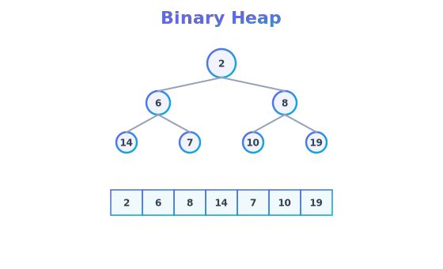

A binary heap is a complete binary tree that satisfies the heap property.

As a refresher, a complete binary tree is a tree in which every level, except possibly the last, is completely filled, and all nodes are as far left as possible. This property allows binary heaps to be efficiently represented using an array.

Complete tree height = ceil(log2(n + 1)) - 1 (n is number of nodes)

A binary heap is a complete binary tree that satisfies the heap property. The heap property can be of two types:

- Max-Heap: In a max-heap, for any given node I, the value of I is greater than or equal to the values of its children. This means that the maximum element is at the root of the tree.

- Min-Heap: In a min-heap, for any given node I, the value of I is less than or equal to the values of its children. This means that the minimum element is at the root of the tree.

The binary heap is used when we need to efficiently access the maximum or minimum element, as it allows for **O(1)** time complexity for accessing the root element. Insertion and deletion operations in a binary heap have a time complexity of **O(log n)** due to the need to maintain the heap property after adding or removing elements.

The binary heap is widely used in various applications, such as priority queues, sorting algorithms (like heapsort), and graph algorithms (like Dijkstra's algorithm). Its efficient operations make it a fundamental data structure in computer science.

## Implementation

The binary heap is commonly implemented using an array, where the parent-child relationships can be easily determined using index calculations. For a node at index i:

- The left child is located at index `2i + 1`
- The right child is located at index `2i + 2`
- The parent is located at index `floor((i - 1) / 2)`

## Heap ADT (Abstract Data Type)

- `insert(value)`: Inserts a new value into the heap while maintaining the heap property.
- `delete()`: Removes and returns the root element (the maximum in a max-heap or the minimum in a min-heap) and then re-heapifies to maintain the heap property.
- `peek()`: Returns the root element without removing it from the heap.
- `heapify(array)`: Converts an arbitrary array into a binary heap.
- `size()`: Returns the number of elements in the heap.
- `isEmpty()`: Returns true if the heap is empty, false otherwise.
- `clear()`: Removes all elements from the heap, resetting it to an empty state.
