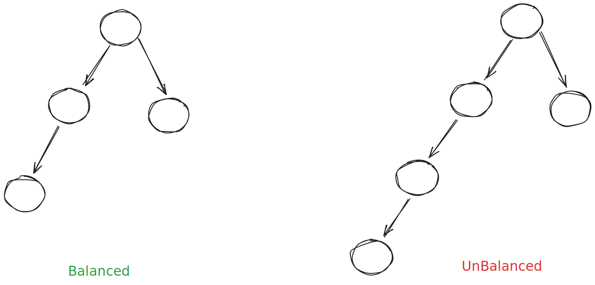

# Binary Tree

- Each node has at most two children.

## Terminology

- **Leaf Node**: A node that does not have any children.
- **Internal Node**: A node that has at least one child.
- **Root Node**: The topmost node in the tree.
- **Height of a Tree**: The number of edges on the longest path from root node to a leaf. (Height is about going down)
- **Depth of a Node**: The number of edges from the root to the node. (Depth is about going up)
- **Level of a Node**: The number of nodes along the path from the root to the node (including the node itself).

## Traversals

1. **In-order Traversal** (LVR)
   - Visit the left subtree
   - Visit the value
   - Visit the right subtree

2. **Pre-order Traversal** (VLR)
   - Visit the value
   - Visit the left subtree
   - Visit the right subtree

3. **Post-order Traversal** (LRV)
   - Visit the left subtree
   - Visit the right subtree
   - Visit the value

## Formulas

- internal nodes = total nodes - leaf nodes

- leaf nodes = internal nodes + 1 (for a non-empty binary tree)

- min nodes (n) = h + 1 (min nodes for unbalanced tree of height h)

- min nodes (n) = 2h + 1 (min nodes for balanced tree of height h)

- max nodes = 2^(h+1) - 1

- min levels = ceil(log2(nodes + 1))

- min levels = ceil(log2(leaf nodes)) + 1

- For each level L, max no. nodes = 2^L (L starts from 0)

- For L levels, min nodes = 2^L - 1 (L starts from 0)

## Other types of Binary Trees

### Full Binary Tree

- Every node has 0 or 2 children.

- General version is called K-ary tree where each node can have 0 or K children.

- min nodes (to achieve full binary tree) = 2 * h + 1 (h is height of the tree) (min nodes for max height)

- max height = n-1 / 2 (max height for min n nodes)

### Perfect Binary Tree

- All leaf nodes are at the same level.

- All internal nodes have exactly two children.

- no. nodes = 2^(h+1 = levels) - 1 (max nodes for h height)

- h = log2(n + 1) - 1 (min height for n nodes)

### Complete Binary Tree

- All levels are fully filled except possibly the last level, which is filled from left to right.

### Degenerate (Pathological) Tree

- Each parent node has only one child, resembling a linked list.

- Given N nodes, we can construct largest depth of N using a degenerate tree.

- Smallest depth of log(N) can be achieved using a balanced binary tree.

- min nodes (n) = h + 1 (min nodes for unbalanced tree of height h)

### Balanced Binary Tree

- In a balanced binary tree, the depth of the two subtrees of every node never differs by more than one.

- We try to keep the height of the tree as small as possible.

- Perfect/Completed binary trees are always balanced, but a balanced binary tree is not necessarily perfect or complete.
